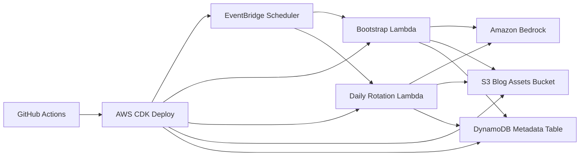

# AWS Blog Automation

AWS-native automated blog generation pipeline built with Node.js, AWS CDK, Lambda, EventBridge Scheduler, S3, DynamoDB, Bedrock, and GitHub Actions.

## What It Does

- On Day 1, schedules and generates 10 initial blog posts automatically.
- Every following day, generates 1 fresh post and archives 1 older published post.
- Creates a matching featured image for every blog post with Amazon Bedrock image generation.
- Stores markdown content and images in S3, and stores blog metadata plus workflow state in DynamoDB.
- Deploys through GitHub Actions using `AWS_ACCESS_KEY_ID` and `AWS_SECRET_ACCESS_KEY` stored in GitHub Secrets.

## Architecture



## Project Structure

```text
.
|-- .github/workflows/deploy.yml
|-- docs/setup.md
|-- infra/
|   |-- bin/blog-automation.ts
|   `-- lib/blog-automation-stack.ts
|-- src/
|   |-- config/prompts.ts
|   |-- handlers/
|   |   |-- bootstrap.ts
|   |   `-- daily-rotation.ts
|   |-- services/
|   |   |-- bedrock-service.ts
|   |   |-- blog-pipeline.ts
|   |   |-- manifest.ts
|   |   |-- metadata-repository.ts
|   |   |-- runtime.ts
|   |   `-- storage-service.ts
|   |-- shared/
|   |   |-- dates.ts
|   |   |-- env.ts
|   |   |-- logger.ts
|   |   `-- slug.ts
|   `-- types/blog.ts
|-- tests/
|   |-- manifest.test.ts
|   `-- slug.test.ts
|-- .env.example
|-- cdk.json
|-- package.json
`-- tsconfig.json
```

## AWS Resources Created

- `S3 Bucket`
  Stores published markdown, archived markdown, featured images, and a published-post manifest JSON.
- `DynamoDB Table`
  Stores blog metadata, bootstrap state, and daily rotation state.
- `Bootstrap Lambda`
  Generates the initial Day 1 inventory.
- `Daily Rotation Lambda`
  Generates 1 post and archives 1 old post each day.
- `EventBridge Scheduler`
  Triggers the one-time bootstrap flow and the recurring daily rotation flow.
- `IAM Roles`
  Lambda execution role and Scheduler invoke role.
- `SQS DLQ`
  Captures failed Scheduler deliveries.

## Storage Layout

```text
s3://<bucket>/
|-- published/
|   |-- posts/<slug>/index.md
|   |-- images/<slug>/featured.png
|   `-- posts-manifest.json
`-- archive/
    |-- posts/<slug>/index.md
    `-- images/<slug>/featured.png
```

## Environment and Secrets

GitHub Secrets:

- `AWS_ACCESS_KEY_ID`
- `AWS_SECRET_ACCESS_KEY`

Recommended GitHub Variables:

- `AWS_REGION`
- `BEDROCK_REGION`
- `STACK_NAME`
- `SCHEDULE_TIMEZONE`
- `DAILY_SCHEDULE_EXPRESSION`
- `BOOTSTRAP_DELAY_MINUTES` or `BOOTSTRAP_AT`
- `BLOG_BRAND_NAME`
- `BLOG_AUTHOR_NAME`
- `BLOG_TONE`
- `BLOG_CATEGORY_THEMES`
- `TEXT_MODEL_ID`
- `IMAGE_MODEL_ID`
- `SITE_BASE_URL`
- `PUBLIC_ASSET_BASE_URL`

## Setup

Full setup and IAM guidance lives in [docs/setup.md](./docs/setup.md).

Follow the detailed guide for:

- AWS prerequisites
- Bedrock model access
- GitHub Secrets and Variables
- IAM permissions
- First deployment
- How the Day 1 and daily automation behave

## Notes

- The S3 bucket is private by default. If you want public blog/media URLs, front it with CloudFront and set `PUBLIC_ASSET_BASE_URL`.
- The bootstrap schedule defaults to deployment time plus 10 minutes unless `BOOTSTRAP_AT` is provided.
- The daily handler archives by moving the oldest published post from the `published/` prefix to the `archive/` prefix and updating its metadata status to `archived`.
